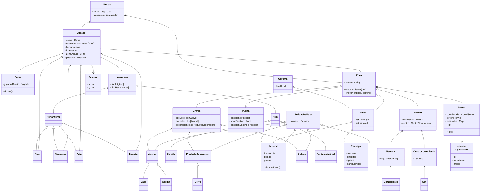

# Diagrama de Clases

```mermaid
classDiagram
class Jugador{
    - cama : Cama
    - monedas rand entre 0-100
    - herramientas
    - inventario
    - zonaActual : Zona
    - posicion : Posicion
}

class Herramienta {}

class Pico {}
class Regadera {}
class Pala {}
class Espada {}

Herramienta <|-- Pico
Herramienta <|-- Regadera
Herramienta <|-- Pala
Herramienta <|-- Espada

Jugador <-- Pico
Jugador <-- Regadera
Jugador <-- Pala
Jugador <-- Espada

class Cama {
    - jugadorDueño : Jugador

    - dormir()
}

Jugador <-- Cama

class Item {

}

class Animal {

}

class Vaca {
}

class Gallina {
}

Animal <|-- Vaca
Animal <|-- Gallina

class Semilla {
}

class ProductoDecoracion {

}

class Cofre {}

ProductoDecoracion <|-- Cofre

class Mineral {}

class Cultivo {}

class ProductoAnimal {}

Item <|-- Semilla
Item <|-- Mineral
Item <|-- ProductoAnimal

class Inventario {
    - list[list[item]]
    - list[Herramienta]
}

Inventario <-- Item
Inventario <-- Herramienta

Jugador <-- Inventario

%% Revisar patron builder para Mineral y Enemigo
class Mineral {
    - frecuencia
    - tiempo
    - precio

    + efectoAlPicar()
}

class Enemigo {
    - combate
    - dificultad
    - spawn
    - particularidad
}

class Caverna {
    - list[Nivel]

}

class Nivel {
    - list[Enemigo]
    - list[Mineral]

}

Caverna <-- Nivel

Nivel <-- Enemigo
Nivel <-- Mineral

class Granja {
    - cultivos : list[Cultivo]
    - animales : list[Animal]
    - decoracion : list[ProductoDecoracion]
}

Granja <-- Cultivo
Granja <-- Animal
Granja <-- ProductoDecoracion

class Pueblo {
    - mercado : Mercado
    - centro : CentroComunitario


}

class Mercado {
    - list[Comerciante]
}

%% Con varias habitaciones y objetivos
class CentroComunitario {
    - list[Set]
}

class Set {}

CentroComunitario <-- Set

%% Marnie, Clint, Pierre, Robin
class Comerciante {}

Pueblo <-- Mercado
Pueblo <-- CentroComunitario

Mercado <-- Comerciante

class Mundo {
    - zonas : list[Zona]

    - jugadores : list[Jugador]

}

class Zona {
    - sectores: Map<CoordSector, Sector>

    + obtenerSector(pos)
    + mover(entidad, destino)
}

class Sector {
    - coordenada : CoordSector
    - terreno : byte[][]
    - entidades : Map<Posicion, EntidadDeMapa>
    - lock

    + tick()
}

Zona *-- Sector

class TipoTerreno {
    <<enum>>
    - id
    - transitable
    - arable
}

class Posicion {
    - x : int
    - y : int
}

Sector --> TipoTerreno

Mundo *-- Zona
Mundo <-- Jugador

Zona <|-- Granja
Zona <|-- Pueblo
Zona <|-- Nivel

Jugador --> Posicion
Jugador --> Zona

class Puerta {
    - posicion : Posicion
    - zonaDestino : Zona
    - posicionDestino : Posicion
}
Zona --> Puerta

class EntidadDeMapa {
    - posicion : Posicion
}

EntidadDeMapa <|-- Enemigo
EntidadDeMapa <|-- Animal
EntidadDeMapa <|-- Mineral
EntidadDeMapa <|-- Cultivo
EntidadDeMapa <|-- ProductoDecoracion
```