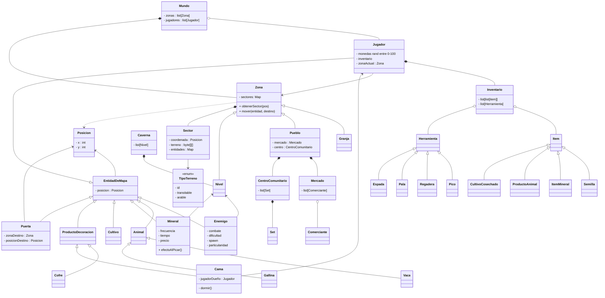

# Diagrama de Clases

```mermaid
classDiagram
class Jugador{
    - monedas rand entre 0-100
    - inventario
    - zonaActual : Zona
}

class Herramienta {}

class Pico {}
class Regadera {}
class Pala {}
class Espada {}

Herramienta <|-- Pico
Herramienta <|-- Regadera
Herramienta <|-- Pala
Herramienta <|-- Espada

class Item {}

class Animal {}

class Vaca {}

class Gallina {}

Animal <|-- Vaca
Animal <|-- Gallina

class Semilla {}
Item <|-- Semilla

class ProductoDecoracion {}
class Cofre {}
class Cama {
    - jugadorDueño : Jugador

    - dormir()
}
ProductoDecoracion <|-- Cofre
ProductoDecoracion <|-- Cama
Cama --> Jugador

class ItemMineral {}

class Cultivo {}
class CultivoCosechado {}

class ProductoAnimal {}
Item <|-- ItemMineral
Item <|-- ProductoAnimal
Item <|-- CultivoCosechado

class Inventario {
    - list[list[item]]
    - list[Herramienta]
}
Inventario o-- Item
Inventario o-- Herramienta
Jugador *-- Inventario

%% Revisar patron builder para Mineral y Enemigo
class Mineral {
    - frecuencia
    - tiempo
    - precio

    + efectoAlPicar()
}

class Enemigo {
    - combate
    - dificultad
    - spawn
    - particularidad
}

class Caverna {
    - list[Nivel]

}

class Nivel {}

Caverna *-- Nivel

Nivel <-- Enemigo
Nivel <-- Mineral

class Granja {}

class Pueblo {
    - mercado : Mercado
    - centro : CentroComunitario
}

class Mercado {
    - list[Comerciante]
}

%% Con varias habitaciones y objetivos
class CentroComunitario {
    - list[Set]
}

class Set {}

CentroComunitario *-- Set

%% Marnie, Clint, Pierre, Robin
class Comerciante {}

Pueblo *-- Mercado
Pueblo *-- CentroComunitario

Mercado o-- Comerciante

class Mundo {
    - zonas : list[Zona]
    - jugadores : list[Jugador]
}
Mundo o-- Jugador

class Zona {
    - sectores: Map<Posicion, Sector>

    + obtenerSector(pos)
    + mover(entidad, destino)
}
Mundo *-- Zona
Zona <|-- Granja
Zona <|-- Pueblo
Zona <|-- Nivel
Jugador --> Zona

class Sector {
    - coordenada : Posicion
    - terreno : byte[][]
    - entidades : Map<Posicion, EntidadDeMapa>
    %% - lock

    %% + tick()
}
Zona *-- Sector

class TipoTerreno {
    <<enum>>
    - id
    - transitable
    - arable
}
Sector --> TipoTerreno

class Posicion {
    - x : int
    - y : int
}
Zona ..> Posicion

class Puerta {
    - zonaDestino : Zona
    - posicionDestino : Posicion
}

class EntidadDeMapa {
    - posicion : Posicion
}
Posicion <-- EntidadDeMapa
Posicion <-- Puerta

EntidadDeMapa <|-- Enemigo
EntidadDeMapa <|-- Animal
EntidadDeMapa <|-- Mineral
EntidadDeMapa <|-- Cultivo
EntidadDeMapa <|-- ProductoDecoracion
EntidadDeMapa <|-- Puerta
EntidadDeMapa <|-- Jugador
```
